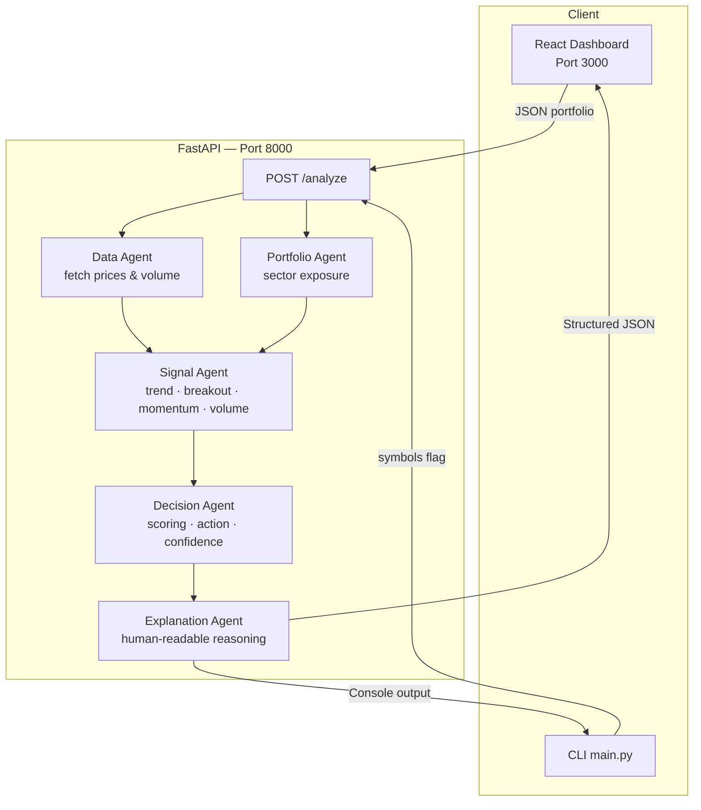

<div align="center">

# 🤖 AI Investor Agent

### Portfolio-aware, multi-agent stock intelligence platform

[](https://www.python.org/)
[](https://fastapi.tiangolo.com/)
[](https://react.dev/)
[](https://recharts.org/)
[](https://pypi.org/project/yfinance/)
[](https://github.com/romin711/ai-investor-agent)

<br/>

> **Analyze any stock in seconds.** Submit your portfolio, receive per-symbol decisions backed by trend, momentum, breakout, and volume signals — all enriched with sector-level diversification context.

</div>

---

## 📋 Table of Contents

- [Overview](#-overview)
- [Key Features](#-key-features)
- [System Architecture](#-system-architecture)
- [Agent Reference](#-agent-reference)
- [Decision Logic](#-decision-logic)
- [Project Structure](#-project-structure)
- [Prerequisites](#-prerequisites)
- [Quick Start](#-quick-start)
- [API Reference](#-api-reference)
- [React Dashboard](#-react-dashboard)
- [CLI Usage](#-cli-usage)
- [Configuration](#-configuration)
- [Supported Symbols](#-supported-symbols)
- [Contributing](#-contributing)
- [Disclaimer](#-disclaimer)

---

## 🔍 Overview

**AI Investor Agent** is a full-stack, rule-based stock analysis platform built around a pipeline of five specialised agents. Submit a weighted portfolio via the React UI or REST API and receive per-symbol recommendations with confidence scores, human-readable explanations, and sector diversification insights — all in real time.

The system is intentionally lightweight: no external AI service keys are required. All intelligence is derived from live market data fetched via `yfinance`, processed through deterministic signal and decision rules.

---

## ✨ Key Features

| Feature | Details |
|---|---|
| 🔄 **Multi-agent pipeline** | Five decoupled agents cooperate to produce a final decision |
| 📈 **Live market data** | Prices and volume fetched in real time via `yfinance`; graceful fallback on failures |
| 🧠 **Signal analysis** | Trend, momentum (%), breakout detection, and volume conviction |
| 🏦 **Portfolio context** | Sector-level exposure, overexposure detection, and diversification suggestions |
| 🎯 **Decision engine** | Confidence-scored actions: `Buy`, `Hold`, `Reduce`, `Light Reduce`, `Avoid`, `No Trade` |
| 💬 **Explanations** | Plain-language reasoning for every decision |
| 📊 **React dashboard** | Finance-style card layout, price line chart, confidence bar, dark/light theme |
| ⚡ **FastAPI backend** | Auto-documented REST API (`/docs`), CORS-ready, fully async |
| 🖥️ **CLI mode** | Run analysis directly from the terminal — no UI required |
| 🌏 **Global symbols** | US equities, NSE/BSE (`.NS`), and other `yfinance`-supported markets |

---

## 🏗️ System Architecture



**Request flow:**

1. The client submits a portfolio (symbol + weight pairs).
2. `Data Agent` fetches live OHLCV data for every symbol.
3. `Portfolio Agent` computes sector-level exposure and flags overconcentration.
4. `Signal Agent` derives trend, momentum, breakout, and volume signals.
5. `Decision Agent` scores the combined signals and selects an action with a confidence level.
6. `Explanation Agent` assembles a plain-language summary, next-action hint, and alternatives.
7. The response JSON is rendered in the React dashboard or printed in the terminal.

---

## 🤖 Agent Reference

### `DataAgent` — `ai_investor_agent/agents/data_agent.py`

Fetches price history and volume data using `yfinance`.

| Output field | Type | Description |
|---|---|---|
| `closing_prices` | `list[float]` | Last 7 trading-day close prices |
| `latest_price` | `float` | Most recent close |
| `data_quality` | `"valid" \| "fallback" \| "missing"` | Reliability flag |
| `data_warning` | `str \| None` | Explanation when data is degraded |

If live data is unavailable (network error, delisted symbol), a deterministic fallback series is generated from the symbol's characters so the pipeline always completes.

---

### `PortfolioAgent` — `ai_investor_agent/agents/portfolio_agent.py`

Maps each holding to a sector and calculates concentration.

| Output field | Description |
|---|---|
| `sector_exposure` | `{sector: weight_pct}` dict sorted by concentration |
| `overexposure` | `true` when any sector exceeds 50 % of the portfolio |
| `overexposed_sectors` | List of sector names over the threshold |
| `diversification_suggestions` | Actionable rebalancing hints |
| `symbol_sector_map` | Symbol → sector lookup used downstream |

**Supported sectors:** Technology · Financials · Energy · Healthcare · Consumer · IT · Other

---

### `SignalAgent` — `ai_investor_agent/agents/signal_agent.py`

Derives technical signals from price and volume data.

| Signal | Calculation |
|---|---|
| **Trend** | `uptrend` if 5-day momentum > 1 %, `downtrend` if < −1 %, else `neutral` |
| **Momentum %** | `(close_today − close_5d_ago) / close_5d_ago × 100` |
| **Breakout** | `true` if latest close exceeds the 5-day prior high |
| **Volume strength** | `high` ≥ 1.20 × avg · `low` < 0.80 × avg · otherwise `normal` |
| **Volume ratio** | `current_volume / avg_volume_5d` |

---

### `DecisionAgent` — `ai_investor_agent/agents/decision_agent.py`

Combines signals into a scored action recommendation.

| Action | Typical trigger |
|---|---|
| `Buy` | Strong uptrend + score ≥ 0.45 |
| `Hold` | Neutral momentum, no strong direction |
| `Light Reduce` | Portfolio overexposed + weak bullish signals |
| `Reduce` | Downtrend with moderate negative momentum (−3.5 % to −1.5 %) |
| `Avoid` | Strong downtrend + momentum ≤ −3.5 % + high volume |
| `No Trade` | Data quality is `missing` |

Confidence is a 0–1 score derived from signal agreement, score magnitude, and volume conviction.

---

### `ExplanationAgent` — `ai_investor_agent/agents/explanation_agent.py`

Assembles a human-readable summary from all agent outputs, including:
- Decision rationale
- Portfolio sector context
- Next recommended action
- Alternative symbols to consider

---

## 🎯 Decision Logic

```
Score = trend_weight + breakout_bonus + momentum_cap + volume_multiplier − sector_penalty

Where:
  trend_weight    = +0.35 (uptrend) | 0 (neutral) | −0.35 (downtrend)
  breakout_bonus  = +0.25 if breakout is true
  momentum_cap    = clamped to [−0.25, +0.25] from (momentum% / 12)
  volume_multiplier: score × 1.08 (high) | score × 0.60 (low) | score × 1.0 (normal)
  sector_penalty  = −0.25 if sector > 50 % | −0.10 if sector ≥ 35 %

Confidence = 0.45 + 0.35 × |score| + 0.20 × signal_agreement  (capped at 1.0)
```

---

## 📁 Project Structure

```text
ai-investor-agent/
├── ai_investor_agent/              # Core Python package
│   ├── agents/
│   │   ├── __init__.py             # Package exports
│   │   ├── data_agent.py           # Live price & volume fetching
│   │   ├── signal_agent.py         # Trend, momentum, breakout, volume signals
│   │   ├── portfolio_agent.py      # Sector exposure & concentration analysis
│   │   ├── decision_agent.py       # Action + confidence scoring
│   │   └── explanation_agent.py   # Plain-language reasoning output
│   ├── api_service.py              # InvestorAnalysisService (used by FastAPI)
│   ├── workflow.py                 # MultiAgentStockAnalyzer orchestrator
│   └── types.py                   # Shared dataclasses (MarketData, TradeDecision …)
├── api.py                          # FastAPI app entry point
├── main.py                         # CLI entry point
├── frontend/                       # React dashboard
│   ├── src/
│   │   ├── App.js                  # Root component + theme provider
│   │   ├── App.css                 # Global finance-style styles
│   │   └── components/
│   │       └── PortfolioAnalyzer.js  # Main UI: input, cards, chart
│   ├── public/
│   └── package.json
└── README.md
```

---

## 🛠️ Prerequisites

| Tool | Minimum version | Purpose |
|---|---|---|
| [Python](https://python.org) | 3.10 | Backend runtime |
| [Node.js](https://nodejs.org) | 18 LTS | React frontend |
| [npm](https://www.npmjs.com/) | 9+ | Frontend package manager |
| Internet access | — | `yfinance` live data fetching |

---

## 🚀 Quick Start

### 1 — Clone the repository

```bash
git clone https://github.com/romin711/ai-investor-agent.git
cd ai-investor-agent
```

### 2 — Backend (FastAPI)

```bash
# Create and activate a virtual environment
python -m venv .venv
source .venv/bin/activate          # Windows: .venv\Scripts\activate

# Install dependencies
pip install fastapi "uvicorn[standard]" pydantic yfinance

# Start the API server
uvicorn api:app --reload --host 127.0.0.1 --port 8000
```

| URL | Description |
|---|---|
| `http://127.0.0.1:8000` | Health check (`GET /`) |
| `http://127.0.0.1:8000/docs` | Interactive Swagger UI |
| `http://127.0.0.1:8000/redoc` | ReDoc API documentation |
| `http://127.0.0.1:8000/analyze` | Analysis endpoint (`POST`) |

### 3 — Frontend (React Dashboard)

Open a second terminal:

```bash
cd frontend
npm install
npm start
```

| URL | Description |
|---|---|
| `http://localhost:3000` | React dashboard |

> The frontend proxies all `/analyze` requests to `http://localhost:8000`.

---

## 📡 API Reference

### `GET /`

Health check. Returns a simple status message.

**Response**

```json
{
  "message": "AI Investor Agent API is running.",
  "analyze_endpoint": "POST /analyze"
}
```

---

### `POST /analyze`

Submit a portfolio and receive per-symbol analysis.

**Request body** — array of portfolio items:

```json
[
  { "symbol": "AAPL", "weight": 40 },
  { "symbol": "MSFT", "weight": 30 },
  { "symbol": "JPM",  "weight": 30 }
]
```

| Field | Type | Required | Description |
|---|---|---|---|
| `symbol` | `string` | ✅ | Ticker symbol (`AAPL`, `RELIANCE.NS`, etc.) |
| `weight` | `number` | ✅ | Portfolio weight (any positive unit; normalised internally) |

**Response** — full analysis object:

```json
{
  "portfolio_insight": {
    "sector_exposure": { "Technology": 70.0, "Financials": 30.0 },
    "overexposure": true,
    "overexposed_sectors": ["Technology"],
    "diversification_suggestions": [
      "Trim exposure in Technology; keep each sector closer to 20-35%.",
      "Add stocks from at least one new sector to improve diversification."
    ],
    "risk_notes": [
      "Portfolio has more than 50% in one sector, which can increase drawdown risk."
    ]
  },
  "results": [
    {
      "symbol": "AAPL",
      "stock_data": {
        "price": 214.22,
        "current_volume": 53210000,
        "avg_volume_5d": 49120000,
        "price_history": [208.5, 209.1, 210.8, 212.3, 214.22],
        "data_warning": null
      },
      "signals": {
        "trend": "uptrend",
        "breakout": true,
        "momentum_percent": 2.73,
        "volume_strength": "high",
        "volume_ratio": 1.08,
        "data_quality": "valid"
      },
      "decision": "Buy",
      "confidence": 0.78,
      "confidence_reason": "Strong trend and high volume confirm the signal.",
      "explanation": "AAPL is in an uptrend with positive momentum (+2.7%) ...",
      "portfolio_insight": "Technology sector is overexposed at 70%.",
      "next_action": "Accumulate in small tranches with stop-loss discipline.",
      "alternatives": ["XOM", "JNJ"]
    }
  ]
}
```

**Error responses**

| Status | Cause |
|---|---|
| `422 Unprocessable Entity` | Validation error (e.g. missing symbol, invalid weight) |
| `500 Internal Server Error` | Unexpected backend failure |

---

## 🖥️ React Dashboard

The dashboard is a single-page app that communicates with the FastAPI backend.

**Workflow:**

1. Enter one or more ticker symbols and optional portfolio weights.
2. Click **Analyze** — results stream in per symbol.
3. Each symbol renders as a finance card displaying:

| Card element | Description |
|---|---|
| **Price & trend badge** | Current price with uptrend/downtrend/neutral badge |
| **Momentum %** | 5-day price momentum percentage |
| **Volume strength** | `high`, `normal`, or `low` with colour coding |
| **Price line chart** | 7-day close-price sparkline (Recharts) |
| **Decision badge** | Colour-coded action: green=Buy, amber=Hold, red=Reduce/Avoid |
| **Confidence bar** | Visual 0–100 % confidence gauge |
| **Explanation** | Plain-language reasoning paragraph |
| **Portfolio insight** | Sector exposure summary and overexposure warning |
| **Next action** | Recommended follow-up step |
| **Alternatives** | Suggested alternative symbols for rebalancing |

**UI Features:**
- 🌙 / ☀️ Dark/light theme toggle
- Responsive layout for desktop and mobile
- Real-time loading state and error handling

---

## 💻 CLI Usage

Run a quick analysis without launching the UI:

```bash
# Activate the virtual environment first
source .venv/bin/activate

# Single symbol
python main.py --symbols AAPL

# Multiple symbols (US + Indian market)
python main.py --symbols AAPL,MSFT,RELIANCE.NS,TCS.NS

# Example output
# === Portfolio Context ===
# Sample Portfolio: [{'symbol': 'AAPL', 'weight': 30}, ...]
# Sector Exposure: {'Technology': 70.0, 'Financials': 20.0, 'Energy': 10.0}
# Overexposure Flag: True
#
# === Analysis For AAPL ===
# Decision
# - Action: Buy
# - Allocation Hint: medium
# Confidence + Reason
# - Confidence: 0.78
# - Reason: Strong trend and high volume confirm the signal.
```

> **Note:** The CLI uses a hardcoded sample portfolio for sector context. Edit `SAMPLE_PORTFOLIO` in `main.py` to customise it.

---

## ⚙️ Configuration

No `.env` file is required. All configuration is done through runtime arguments or constants in the source files.

| Setting | Location | Default | Description |
|---|---|---|---|
| API host | `uvicorn` command | `127.0.0.1` | Bind address for the backend |
| API port | `uvicorn` command | `8000` | Port for the backend |
| Frontend port | `npm start` | `3000` | Port for the React dev server |
| Overexposure threshold | `portfolio_agent.py` | 50 % | Sector weight above which overexposure is flagged |
| Underweight threshold | `decision_agent.py` | 15 % | Sector weight below which rebalancing is suggested |
| Price history window | `data_agent.py` | 7 days | Number of close prices returned per symbol |
| Volume avg window | `data_agent.py` | 5 days | Lookback for average volume calculation |

---

## 🌏 Supported Symbols

Any ticker supported by [Yahoo Finance](https://finance.yahoo.com/) can be used. Common examples:

| Market | Examples |
|---|---|
| 🇺🇸 US Equities | `AAPL`, `MSFT`, `GOOGL`, `NVDA`, `JPM`, `XOM`, `JNJ` |
| 🇮🇳 NSE (India) | `RELIANCE.NS`, `TCS.NS`, `INFY.NS`, `HDFCBANK.NS`, `SBIN.NS` |
| 🇬🇧 LSE (UK) | `SHEL.L`, `AZN.L`, `HSBA.L` |
| 🇩🇪 XETRA (Germany) | `SAP.DE`, `SIE.DE` |

> Sector mapping is pre-configured for common US and Indian symbols. Symbols not in the map are classified as `Other`.

---

## 🤝 Contributing

Contributions are welcome! Here's how to get started:

1. **Fork** the repository and create a feature branch:
   ```bash
   git checkout -b feature/your-feature-name
   ```
2. **Make your changes** and add or update tests if applicable.
3. **Lint & test** your code:
   ```bash
   # Python (from repo root)
   pip install ruff
   ruff check .

   # Frontend
   cd frontend && npm test
   ```
4. **Open a pull request** with a clear description of what you changed and why.

**Ideas for contribution:**
- Extend `SECTOR_MAP` with more global tickers
- Add new signal types (RSI, MACD, Bollinger Bands)
- Persist portfolio history to a database
- Add unit and integration tests
- Improve the React UI (filters, comparison view, export)

---

## ⚠️ Disclaimer

> This project is a **rule-based prototype** built for learning, demos, and experimentation.
>
> - It is **not financial advice**.
> - No real money should be invested based on its output.
> - Market data accuracy depends on `yfinance` and Yahoo Finance availability.
> - Always consult a qualified financial advisor before making investment decisions.
