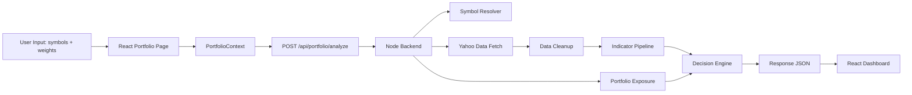

<div align="center">

# AI Investor Agent

### Portfolio-aware stock analysis dashboard


</div>

---

## Overview

AI Investor Agent is a rule-based stock intelligence app with:

- a Node.js backend that fetches Yahoo Finance market data
- a React dashboard for portfolio input and visualization
- portfolio-aware scoring based on trend, RSI, momentum, breakout, and sector exposure
- safe fallbacks for missing data so the app does not invent fake zeros

The current live app uses the `backend/` Node service and the `frontend/` React app.

---

## What The App Does

Given user portfolio rows like:

```json
[
  { "symbol": "RELIANCE", "weight": 40 },
  { "symbol": "TCS", "weight": 30 },
  { "symbol": "INFY", "weight": 30 }
]
```

the system:

1. normalizes the input symbols and weights
2. resolves each symbol to a Yahoo Finance ticker
3. fetches historical market data
4. cleans invalid price points
5. calculates indicators such as MA20, MA50, RSI, momentum, and breakout
6. adds portfolio context like sector concentration
7. produces a final decision such as `BUY`, `SELL`, or `HOLD`
8. renders the output in the dashboard as cards, chart, confidence, and reasoning

---

## System Flow



---

## Theory: How Input Becomes Output

This is the core idea of the project.

### 1) User input becomes normalized portfolio rows

The user enters data in the frontend, either by:

- uploading JSON
- typing rows manually

The frontend converts that into a clean internal array:

```json
[
  { "symbol": "RELIANCE", "weight": 40 },
  { "symbol": "TCS", "weight": 30 }
]
```

At this stage:

- symbols are uppercased
- weights are converted to numbers
- empty rows are ignored
- invalid weights are rejected

### 2) The frontend sends the portfolio to the backend

When the user clicks analyze, the frontend sends a `POST` request to:

```text
/api/portfolio/analyze
```

The backend accepts multiple request styles:

- array of rows
- `portfolio` object map
- raw text input

but internally converts all of them into the same row structure.

### 3) Symbols are resolved to Yahoo-compatible tickers

User input is often human-friendly, for example:

- `RELIANCE`
- `TCS`
- `INFY`

The backend resolves these into Yahoo Finance symbols such as:

- `RELIANCE.NS`
- `TCS.NS`
- `INFY.NS`

Resolution uses:

- a local symbol map from `backend/engine/stocks.json`
- fuzzy matching for near-miss tickers
- optional Gemini fallback if mapping fails

### 4) Yahoo market data is fetched and cleaned

For each resolved symbol, the backend requests chart data from Yahoo Finance.

Then it cleans the data before calculations:

- removes `null`, `NaN`, and invalid close values
- keeps valid historical points only
- sorts data oldest to latest
- keeps price history for charting and indicators

This matters because technical indicators depend on time order and valid numeric values.

### 5) Indicators are calculated from historical closes

After cleanup, the backend computes:

- `MA20`: average of the latest 20 valid closes
- `MA50`: average of the latest 50 valid closes
- `RSI(14)`: gain/loss strength over 14 periods
- `Momentum`: percentage move vs. a 5-day lookback
- `Volatility`: latest daily percentage move
- `Breakout`: whether current price is above the previous 20-day high

If there is not enough history, the indicator returns `null`, not `0`.

That is a deliberate design choice:

- `0` would look like a real market signal
- `null` correctly means "not enough data"

### 6) Portfolio context changes the interpretation

The app does not look at each stock in isolation.

It also computes portfolio context:

- sector allocation
- overexposed sectors
- the sector exposure of the current symbol

Example:

- if the portfolio is already 80% in one sector, even a good technical setup may be downgraded

This is handled through a portfolio adjustment layer.

### 7) Technical score and portfolio score become a final decision

The decision engine combines:

- technical score
- portfolio adjustment

to create a final score.

Basic idea:

- strong bullish signals raise the score
- weak or bearish signals lower the score
- concentration risk can reduce the score further

Then the decision is mapped approximately like this:

- high positive score -> `BUY`
- high negative score -> `SELL`
- middle zone -> `HOLD`

Confidence is then derived from:

- score magnitude
- RSI neutrality
- distance between price and MA50

### 8) Missing critical indicators trigger a safety guard

If key indicators are missing, the app does not try to bluff confidence.

Instead it forces:

- `decision = HOLD`
- `confidence = low`
- `reason = "Insufficient data"`

The frontend then shows:

- `Not enough data`

instead of `0` or `--`.

### 9) The backend returns structured output

For each symbol, the backend returns data such as:

- current price
- historical series
- MA20 / MA50 / RSI
- momentum and breakout
- technical score
- portfolio adjustment
- final score
- decision
- confidence
- reasoning

It also returns portfolio-level insight such as:

- sector allocation
- overexposed sectors
- top-level portfolio summary

### 10) The frontend transforms JSON into UI

The React dashboard turns the response into:

- a price chart
- tracked stock cards
- RSI / MA metrics
- decision badge
- confidence display
- portfolio insight panel
- signals list
- reasoning panel

So the final theory is:

```text
User input -> normalization -> symbol resolution -> Yahoo data -> cleanup ->
indicator calculation -> portfolio adjustment -> decision engine -> API response ->
dashboard rendering
```

---

## Current Stack

### Backend

- Node.js HTTP server
- Yahoo Finance chart API
- optional Gemini fallback for ticker resolution / reasoning

### Frontend

- React
- React Router
- Axios
- Recharts
- Tailwind-based styling

---

## Project Structure

```text
ai-investor-agent/
├── backend/
│   ├── server.js
│   ├── README.md
│   ├── package.json
│   └── engine/
│       ├── pipeline.js
│       ├── yahooClient.js
│       ├── symbolResolver.js
│       ├── indicators.js
│       ├── indicatorService.js
│       ├── portfolioService.js
│       ├── riskService.js
│       ├── decisionEngine.js
│       ├── aiService.js
│       └── stocks.json
├── frontend/
│   ├── package.json
│   └── src/
│       ├── context/
│       ├── pages/
│       ├── components/
│       └── layout/
├── ai_investor_agent/
├── api.py
├── main.py
└── README.md
```

Note:

- `backend/` + `frontend/` is the current live web app path
- `ai_investor_agent/`, `api.py`, and `main.py` are older prototype assets kept in the repo

---

## Quick Start

### 1) Start the backend

```bash
cd backend
cp .env.example .env
npm install
npm start
```

Default backend URL:

```text
http://127.0.0.1:3001
```

Optional backend `.env` values:

```env
PORT=3001
HOST=127.0.0.1
GEMINI_API_KEY=
```

### 2) Start the frontend

```bash
cd frontend
npm install
npm start
```

Default frontend URL:

```text
http://localhost:3000
```

Optional frontend env:

```env
REACT_APP_API_BASE_URL=http://127.0.0.1:3001
```

---

## API

### Health check

```text
GET /health
```

### Single stock analysis

```text
GET /api/stock/:symbol
```

Example:

```text
GET /api/stock/RELIANCE
```

### Portfolio analysis

```text
POST /api/portfolio/analyze
```

Example request:

```json
[
  { "symbol": "RELIANCE", "weight": 50 },
  { "symbol": "TCS", "weight": 30 },
  { "symbol": "INFY", "weight": 20 }
]
```

Example response:

```json
{
  "portfolioInsight": "Technology sector exposure is 60.00%",
  "sectorAllocation": {
    "Technology": 60,
    "Energy": 40
  },
  "overexposedSectors": [],
  "results": [
    {
      "symbol": "RELIANCE",
      "resolvedSymbol": "RELIANCE.NS",
      "price": 2941.35,
      "historical": [
        { "date": "2026-03-19", "close": 2880.4 },
        { "date": "2026-03-20", "close": 2892.6 }
      ],
      "trend": "neutral",
      "rsi": 52.61,
      "ma20": 2901.84,
      "ma50": 2890.12,
      "momentum_percent": 2.04,
      "volatility_percent": 0.44,
      "breakout": false,
      "technical_score": 1,
      "portfolio_adjustment": 0,
      "risk_score": 0,
      "final_score": 1,
      "decision": "HOLD",
      "confidence": 20,
      "data_warning": null,
      "reason": "Gemini API key not configured.",
      "next_action": "Evaluate manually based on signals."
    }
  ]
}
```

---

## Important Behaviors

- Missing or invalid Yahoo values are removed before indicator calculation
- Historical data is processed oldest to latest
- Indicators return `null` if history is insufficient
- The backend does not use default `0` values for missing indicators
- Missing key indicators trigger a safe `HOLD` decision
- The frontend shows `Not enough data` for missing metrics
- Insufficient-data cases are logged in the backend for debugging

---

## Disclaimer

This project is a rule-based prototype for demos, experimentation, and learning.

It is not financial advice.
