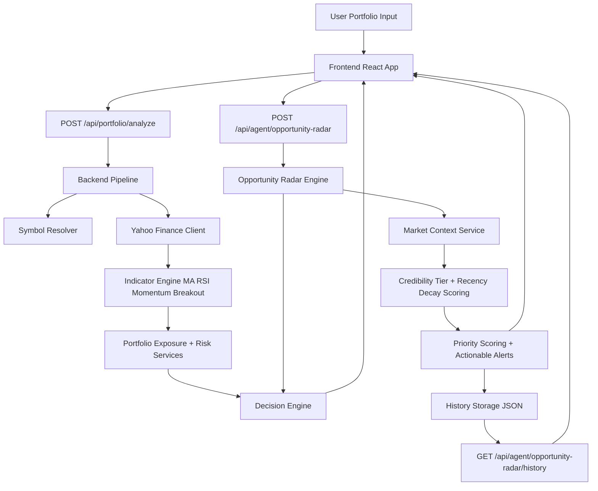

<div align="center">

# AI Investor Agent
### Portfolio-Aware Decision Intelligence for Indian Equities


</div>

---

## Project Overview
AI Investor Agent is a full-stack decision-support system that helps investors analyze portfolio positions and detect actionable opportunities from live market data.

It addresses a common investing problem: most tools either show raw indicators without portfolio context, or provide generic recommendations without explaining concentration risk and data freshness. This project combines both.

Given portfolio holdings, the system:
- fetches market history from Yahoo Finance
- computes technical indicators and signal strength
- adjusts decisions using portfolio sector exposure
- enriches opportunities with market-context events (results, filings, deals)
- ranks alerts with explainable scoring and stores historical radar runs

---

## Unique Value Proposition
Most AI investor demos stop at "BUY/SELL/HOLD". This project is different because it implements a practical decision pipeline with explainability and portfolio-aware risk controls.

### What makes it different
- **Portfolio-aware scoring**: decisions are not symbol-only; sector concentration modifies confidence and priority.
- **Autonomous 3-step Opportunity Radar**: signal detection -> portfolio context enrichment -> actionable alerts.
- **Context credibility + recency model**: market events are weighted by source quality and time decay.
- **Persisted radar history**: historical scans are stored and exposed via API for review in UI.
- **Fail-safe reasoning fallback**: if Gemini is unavailable or misconfigured, rule-based reasoning still returns clear output.

---

## Demo
### Live Demo Placeholders
- Dashboard Screenshot: `docs/demo/dashboard.png`
- Opportunity Radar Screenshot: `docs/demo/opportunity-radar.png`
- Alert Filters GIF: `docs/demo/filters.gif`

```md


```

### How It Works Visually
1. User inputs portfolio symbols and weights
2. System analyzes each symbol with technical + portfolio context
3. Opportunity Radar generates ranked alerts
4. UI displays credibility-tagged context signals and history timeline

---

## Features
- 📈 **Live Portfolio Analysis**: symbol resolution, market fetch, indicator computation, and decision output.
- 🧠 **Decision Engine**: combines technical score with portfolio adjustment and risk score.
- 🛰️ **Opportunity Radar Agent**: autonomous 3-step workflow for actionable opportunity generation.
- 🧾 **Source-Cited Context Signals**: filings/results/deals with URLs, impact, credibility tier, and recency metadata.
- 🎯 **Priority Ranking**: alerts ranked using signal strength, confidence, breakout bonus, context score, and exposure penalty.
- 🗂️ **Radar History Persistence**: latest runs stored in backend storage and served to frontend.
- 🎛️ **Radar UI Filters**: action, risk flag, credibility tier, and sort controls.
- 🧪 **Automated Tests**: backend unit/integration tests + frontend Opportunity Radar smoke tests.

---

## Architecture
### System Flow
Input -> Symbol Resolution -> Market Data + Indicators -> Portfolio Exposure -> Decision Engine -> Opportunity Radar Enrichment -> Ranked Alerts -> UI + History

### Mermaid Diagram


### Opportunity Radar Pipeline
1. `detect_signal`
2. `enrich_with_portfolio_context`
3. `generate_actionable_alert`

---

## Tech Stack
### Frontend
- React 18
- React Router 6
- Axios
- Lightweight Charts (TradingView)
- Tailwind CSS

### Backend
- Node.js (HTTP server)
- Modular engine services (`pipeline`, `decisionEngine`, `portfolioService`, `riskService`)
- File-based persistence for radar history

### AI / Reasoning
- Gemini API integration (optional)
- Rule-based fallback reasoning when API key is missing/invalid

### Data Sources
- Yahoo Finance chart/price data
- Local market context event dataset (`backend/engine/market_context_events.json`)

---

## Installation & Setup
### Prerequisites
- Node.js 18+
- npm 9+

### 1) Clone
```bash
git clone https://github.com/romin711/ai-investor-agent.git
cd ai-investor-agent
```

### 2) Backend setup
```bash
cd backend
npm install
cp .env.example .env
npm start
```

Backend default:
```text
http://127.0.0.1:3001
```

### 3) Frontend setup
```bash
cd ../frontend
npm install
npm start
```

Frontend default:
```text
http://localhost:3000
```

### Environment Variables
Backend `.env` example:
```env
PORT=3001
HOST=127.0.0.1
GEMINI_API_KEY=
```

Frontend optional `.env`:
```env
REACT_APP_API_BASE_URL=http://127.0.0.1:3001
```

---

## Usage
### A) UI Usage
1. Open `http://localhost:3000`
2. Add portfolio rows (symbol + weight)
3. Run analysis
4. Navigate to Opportunity Radar for ranked alerts and history

### B) API Usage
#### Portfolio Analyze
```bash
curl -X POST http://127.0.0.1:3001/api/portfolio/analyze \
  -H "Content-Type: application/json" \
  -d '[
    {"symbol":"RELIANCE","weight":40},
    {"symbol":"TCS","weight":35},
    {"symbol":"INFY","weight":25}
  ]'
```

#### Opportunity Radar
```bash
curl -X POST http://127.0.0.1:3001/api/agent/opportunity-radar \
  -H "Content-Type: application/json" \
  -d '[
    {"symbol":"TCS","weight":40},
    {"symbol":"RELIANCE","weight":35}
  ]'
```

#### Radar History
```bash
curl "http://127.0.0.1:3001/api/agent/opportunity-radar/history?limit=5"
```

### Sample Radar Output (trimmed)
```json
{
  "workflow": [
    "detect_signal",
    "enrich_with_portfolio_context",
    "generate_actionable_alert"
  ],
  "autonomous": true,
  "portfolioInsight": "Portfolio heavily concentrated in Technology...",
  "alerts": [
    {
      "symbol": "TCS",
      "action": "HOLD",
      "priorityScore": 29.8,
      "contextSignals": [
        {
          "type": "quarterly_result",
          "impact": "positive",
          "credibilityTier": "news",
          "ageDays": 6,
          "recencyWeight": 0.8,
          "weightedImpactScore": 4.8
        }
      ]
    }
  ]
}
```

---

## Testing
### Backend tests
```bash
cd backend
npm test
```
Covers:
- market context scoring logic
- opportunity radar API integration (positive + negative cases)

### Frontend radar smoke tests
```bash
cd frontend
npm run test:radar
```
Covers:
- action filter behavior
- credibility-tier filter behavior
- history sorting behavior

---

## Folder Structure
```text
ai-investor-agent/
├── backend/
│   ├── server.js                          # Node HTTP API routes
│   ├── package.json
│   ├── storage/
│   │   └── opportunity_radar_history.json # persisted radar runs
│   ├── tests/
│   │   ├── marketContextService.test.js
│   │   └── opportunityRadarApi.test.js
│   └── engine/
│       ├── pipeline.js                    # main analysis orchestration
│       ├── opportunityAgent.js            # 3-step radar pipeline
│       ├── marketContextService.js        # credibility + recency scoring
│       ├── market_context_events.json     # context dataset
│       ├── decisionEngine.js
│       ├── indicatorService.js
│       ├── portfolioService.js
│       ├── riskService.js
│       ├── symbolResolver.js
│       └── yahooClient.js
├── frontend/
│   ├── package.json
│   └── src/
│       ├── App.js
│       ├── context/PortfolioContext.js
│       ├── pages/
│       │   ├── DashboardPage.js
│       │   ├── OpportunityRadarPage.js
│       │   └── OpportunityRadarPage.test.js
│       ├── layout/AppLayout.js
│       └── components/
├── ai_investor_agent/                     # Python prototype module
├── api.py                                 # Python FastAPI prototype entry
├── main.py                                # Python CLI prototype entry
└── README.md
```

---

## Future Improvements
- Add authenticated multi-user portfolios with per-user radar history
- Replace file-based storage with PostgreSQL for durable analytics queries
- Add scheduled intraday radar runs and webhook/notification delivery
- Improve market context ingestion with automated feeds (filings/news APIs)
- Add benchmark-aware scoring (sector index and market regime context)
- Expand frontend test suite to full E2E flows

---

## Contribution
Contributions are welcome.

1. Fork the repository
2. Create a feature branch
3. Make focused changes with tests
4. Run checks:
   - `cd backend && npm test`
   - `cd frontend && npm run test:radar`
5. Open a pull request with clear context and screenshots (if UI changes)

---

## License
No explicit license file is currently present in this repository.
If you plan to open-source for broader reuse, add a `LICENSE` file (for example MIT) in the project root.
