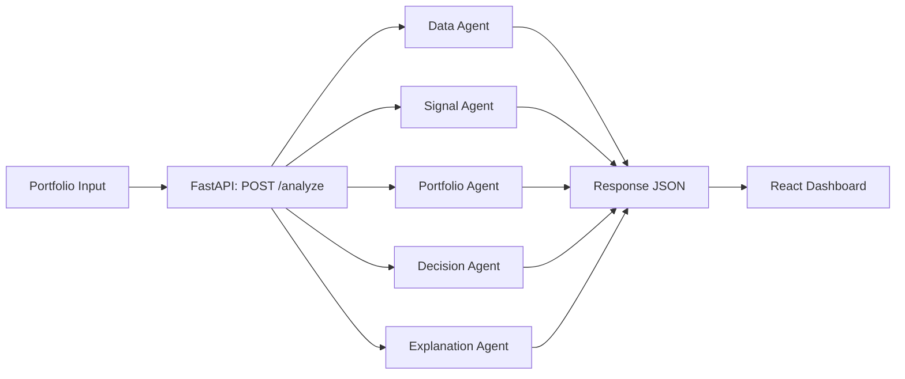

<div align="center">

# AI Investor Agent

### Portfolio-aware stock intelligence dashboard


</div>

---

## Overview

AI Investor Agent combines a multi-agent backend and a modern React UI to:

- Analyze market signal quality (trend, momentum, breakout, volume)
- Add portfolio context (sector concentration and overexposure)
- Produce decisions with confidence (`Buy`, `Hold`, `Reduce`, `Avoid`, `No Trade`)
- Explain reasoning, suggest next action, and show alternatives
- Visualize price history and confidence in a clean finance-style dashboard

---

## System Design



---

## Core Features

| Module | What it provides |
|---|---|
| `data_agent` | Live/fallback market data + data quality flags |
| `signal_agent` | Trend, momentum, breakout, and volume strength |
| `portfolio_agent` | Sector exposure, concentration detection |
| `decision_agent` | Action + confidence scoring |
| `explanation_agent` | Human-readable reasoning output |
| React Dashboard | Input, card view, line chart, decision badge, confidence bar |

---

## Project Structure

```text
ai-investor-agent/
├── ai_investor_agent/
│   ├── agents/
│   │   ├── data_agent.py
│   │   ├── signal_agent.py
│   │   ├── decision_agent.py
│   │   ├── portfolio_agent.py
│   │   └── explanation_agent.py
│   ├── api_service.py
│   ├── workflow.py
│   └── types.py
├── api.py
├── main.py
├── frontend/
│   ├── src/
│   │   ├── App.js
│   │   ├── App.css
│   │   └── components/PortfolioAnalyzer.js
│   └── package.json
└── README.md
```

---

## Quick Start

### 1) Backend (FastAPI)

```bash
python -m venv .venv
source .venv/bin/activate
pip install fastapi "uvicorn[standard]" pydantic yfinance
uvicorn api:app --reload --host 127.0.0.1 --port 8000
```

- API docs: `http://127.0.0.1:8000/docs`

### 2) Frontend (React Dashboard)

```bash
cd frontend
npm install
npm start
```

- Frontend URL: `http://localhost:3000`
- API URL used by frontend: `http://localhost:8000/analyze`

---

## API Contract

### Endpoint

`POST /analyze`

### Request

```json
[
  { "symbol": "AAPL", "weight": 40 },
  { "symbol": "MSFT", "weight": 30 },
  { "symbol": "JPM", "weight": 30 }
]
```

### Response (shape)

```json
{
  "portfolio_insight": {
    "sector_exposure": { "Technology": 70, "Financials": 30 },
    "overexposure": true,
    "overexposed_sectors": ["Technology"],
    "diversification_suggestions": ["Trim exposure in Technology..."]
  },
  "results": [
    {
      "symbol": "AAPL",
      "stock_data": {
        "price": 214.22,
        "current_volume": 53210000,
        "avg_volume_5d": 49120000,
        "price_history": [208.5, 209.1, 210.8, 212.3, 214.22],
        "data_warning": null
      },
      "signals": {
        "trend": "uptrend",
        "breakout": true,
        "momentum_percent": 2.3,
        "volume_strength": "high",
        "volume_ratio": 1.08,
        "data_quality": "valid"
      },
      "decision": "Buy",
      "confidence": 0.78,
      "confidence_reason": "Strong trend and high volume confirm the signal.",
      "explanation": "...",
      "portfolio_insight": "...",
      "next_action": "...",
      "alternatives": ["XOM", "JNJ"]
    }
  ]
}
```

---

## Dashboard Highlights

- Theme toggle: light/dark
- Finance card layout with:
  - Price, trend, momentum
  - Smooth line chart (`price_history`)
  - Decision badge colors
  - Confidence bar visualization
  - Portfolio insight summary
  - Next action and alternatives

---

## CLI Demo (Optional)

```bash
python main.py --symbols AAPL,MSFT,RELIANCE.NS
```

---

## Disclaimer

This is a rule-based prototype for demos and experimentation.  
It is not financial advice.
